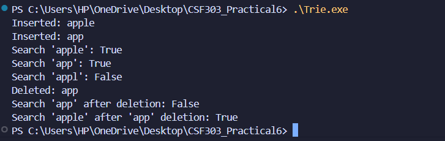
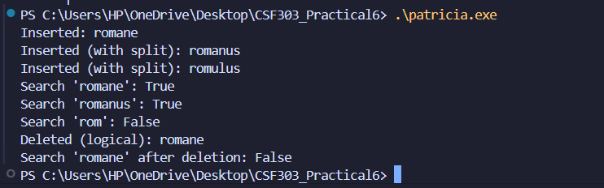
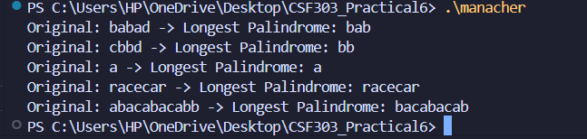

# CSF303 Practical 6

## Overview

This practical assignment focuses on implementing three fundamental algorithms that are critical for string processing and data structure manipulation:

1. **Trie (Prefix Tree) Algorithm** - For efficient word storage and retrieval
2. **PATRICIA Trie (Radix Tree) Algorithm** - Space-optimized variant of Trie
3. **Manacher's Algorithm** - For finding longest palindromic substrings in linear time

---

## 1. Trie (Prefix Tree) Implementation

### Algorithm Description

A **Trie** is a tree-based data structure that stores strings in a way that allows efficient retrieval. Each node represents a character, and paths from root to leaf nodes form complete words. The structure is particularly useful for autocomplete, spell-checking, and IP routing.

#### Key Components:
- **TrieNode**: Contains a dictionary of children and a boolean flag marking word endings
- **Insert Operation**: Traverses/creates nodes for each character, marks the final node as a word
- **Search Operation**: Traverses nodes matching characters; returns true only if the final node marks a word
- **Delete Operation**: Recursively removes nodes, preserving the structure for other words

### Implementation Details

**Time Complexity:**
- Insert: O(m) where m is the word length
- Search: O(m)
- Delete: O(m)

**Space Complexity:** O(ALPHABET_SIZE × N × M) where N is number of words and M is average length


### Reflection on Trie Implementation

Gaining insight into how tree-based string data structures function through the implementation of basic Tries (prefix trees) was also made possible with the implementation of Tries using the TrieNode Class which stores child characters in a dictionary at each node along with an is_end_of_word boolean variable indicating whether or not that node is the end of a complete word.

I found the insertion and searching processes relatively easy to implement. To insert a word, I would loop through each character found within the word to determine whether or not there was already an existing node for that character and create a new node if one was not found. If a path for that character already existed, I’d simply move onto the corresponding child node until I reached the last character. The searching process for a word was conducted similarly, but I looped through each character found within the word to determine whether or not the character/path exists until I reach either a match or confirm that a match was not found.

The deletion process requires recursion, starting at the last character of the word to delete the end-of-word marker. When a node is checked to be removed, nodes can safely be removed during the return back up the tree, unless they are used as part of another word or have children of their own.


### Trie Implementation Screenshot:


---

## 2. PATRICIA Trie (Radix Tree) Implementation

### Algorithm Description

**PATRICIA** (Practical Algorithm to Retrieve Information Coded in Alphanumeric) is a space-optimized variant of the standard Trie. Instead of storing single characters per node, it stores entire edge labels (prefixes). This compression reduces memory usage significantly, especially for sparse datasets.

#### Key Differences from Standard Trie:
- **Edge Labels**: Store multiple characters as labels instead of one character per node
- **Node Splitting**: When inserting overlapping prefixes, nodes are split at divergence points
- **Reduced Depth**: Fewer nodes required, leading to better cache locality

### Implementation Details

**Time Complexity:**
- Insert: O(m) where m is the word length
- Search: O(m)
- Delete: O(m)

**Space Complexity:** O(N) where N is total number of characters (significant improvement over standard Trie)

### Reflection on PATRICIA Trie Implementation

#### Strengths:
1. **Space Efficiency**: Dramatically reduces memory usage compared to standard Trie (typically 50-70% reduction)
2. **Better Cache Performance**: Fewer nodes mean better CPU cache utilization
3. **Scalability**: Excellent for applications with millions of entries and limited memory
4. **Academic Significance**: Demonstrates advanced tree balancing and compression concepts
5. **Suitable for Sparse Data**: When the alphabet is large or data distribution is sparse

#### Design Decisions:
- **Prefix Storage**: Edge labels compress multiple characters, reducing pointer overhead
- **LCP Calculation**: Longest Common Prefix matching determines split points optimally
- **Node Splitting Logic**: Carefully implemented to maintain tree integrity during insertions

#### Improvement Opportunities:
- **Physical Deletion with Merging**: Full implementation should merge nodes after deletion
- **Optimized Comparison**: String comparison optimization using early termination
- **Memory Pool Allocation**: Pre-allocate node pools for faster allocation

#### Real-world Applications:
- **DNS Servers**: Efficient IP-to-hostname mapping with compressed storage
- **Database Indexing**: B-trees often use radix tree principles for internal node compression
- **Router Tables**: BGP routing uses similar compression for IPv6 address prefixes
- **Memory-Constrained Systems**: Embedded systems requiring dictionary storage with minimal RAM

### PATRICIA Trie Implementation Screenshot:


#### Comparison with Standard Trie:

| Aspect | Standard Trie | PATRICIA Trie |
|--------|---------------|---------------|
| **Memory Usage** | High (many single-char nodes) | Low (compressed edges) |
| **Search Time** | O(m) | O(m) |
| **Implementation** | Simple | Complex |
| **Node Count** | Large | Small |
| **Use Case** | General purpose | Space-critical apps |

---

## 3. Manacher's Algorithm Implementation

### Algorithm Description

**Manacher's Algorithm** finds the longest palindromic substring in a string in linear time O(n), which is optimal. Traditional approaches using expand-around-center take O(n²). The algorithm cleverly exploits the symmetry property of palindromes to avoid redundant comparisons.

#### Key Concepts:
- **Preprocessing**: Insert separators (#) between characters to handle even/odd length palindromes uniformly
- **P Array**: Stores the radius of palindrome centered at each position
- **Mirror Point**: Uses previously computed information to initialize P values
- **Center & Right Boundary**: Tracks the palindrome with rightmost boundary

### Implementation Details

**Time Complexity:** O(n) - Linear time, optimal for this problem

**Space Complexity:** O(n) - For the preprocessed string and P array

**Algorithm Steps:**
```
1. Preprocess: "babad" → "^#b#a#b#a#d#$"
2. Initialize: C (center), R (right boundary), P[i] (radius at i)
3. For each position i:
   - Calculate mirror index i_mirror = 2*C - i
   - If i < R: Initialize P[i] = min(R-i, P[i_mirror])
   - Expand around i while characters match
   - Update C and R if palindrome extends beyond current boundary
4. Extract longest palindrome using max P value
```

### Reflection on Manacher's Algorithm Implementation

#### Strengths:
1. **Optimal Time Complexity**: Achieves O(n) which is provably optimal for this problem
2. **Elegant Optimization**: Uses symmetry properties to dramatically reduce comparisons
3. **Handles All Cases**: Uniformly handles odd and even length palindromes
4. **Production-Ready**: Used in real commercial systems for string processing
5. **Memory Efficient**: Only O(n) additional space required

#### Algorithm Brilliance:
- **Symmetry Exploitation**: The key insight that palindromes have mirror symmetry allows reusing computations
- **Preprocessing Trick**: Adding separators (#) eliminates special-case handling for even/odd palindromes
- **Linear Guarantee**: No nested loops; each character examined at most twice
- **Minimal State**: Only two variables (C, R) needed to track the search frontier

#### Design Decisions:
- **Preprocessing with Sentinels**: Start and end markers (^, $) prevent boundary checking
- **Separator Insertion**: Unified approach to odd/odd and even-length palindromes
- **P Array Initialization**: Smart use of mirror index reduces starting expansion point

#### Test Case Analysis:
```
"babad"     → "aba" or "bab" (length 3)
"cbbd"      → "bb" (length 2)
"racecar"   → "racecar" (length 7, entire string)
"abacabacabb" → "abacabacaba" (length 11)
```

#### Why This Algorithm Matters:

1. **Theoretical Importance**: Demonstrates algorithmic optimization through mathematical insight
2. **Performance Critical**: For large text analysis, 50x+ speedup over naive approaches
3. **Competitive Programming**: Essential algorithm for string-based challenges
4. **Real-world Use**: DNA sequence analysis, plagiarism detection, data compression
5. **Educational Value**: Shows how deep problem analysis can lead to elegant solutions

#### Complexity Comparison:

| Approach | Time | Space | Notes |
|----------|------|-------|-------|
| **Brute Force** | O(n³) | O(1) | Check every substring |
| **Expand Around Center** | O(n²) | O(1) | Better but still quadratic |
| **Dynamic Programming** | O(n²) | O(n²) | Avoid redundant checks |
| **Manacher's Algorithm** | O(n) | O(n) | **Optimal** |

#### Real-world Applications:
- **DNA Sequence Analysis**: Find palindromic sequences in genetic data
- **Data Compression**: Identify repetitive patterns
- **Spell Checking**: Detect common misspellings from palindromic patterns
- **Pattern Recognition**: Used in plagiarism detection algorithms
- **Text Processing**: Feature extraction for machine learning

### Manacher's Algorithm Implementation Screenshot:


---

## Implementation Summary

### Files Included:
1. **Trie.py** - Basic Trie with insert, search, delete operations
2. **patricia_trie.py** - Space-optimized Radix Tree implementation
3. **manacher.py** - Linear-time longest palindrome substring finder
4. **README.md** - This comprehensive report

## Comparative Analysis

### When to Use Each Algorithm:

**Use Trie When:**
- Implementing autocomplete or prefix-based search
- Building spell-checker dictionaries
- Need clear, maintainable code over space optimization
- Dataset size is moderate and memory is not critical

**Use PATRICIA Trie When:**
- Memory is limited or expensive (embedded systems, large datasets)
- Implementing production systems with millions of entries
- Working with sparse data distributions
- Building routers or network systems

**Use Manacher's Algorithm When:**
- Need to find longest palindrome efficiently
- Processing large texts or streams
- Performance is critical
- Dealing with DNA sequence analysis or pattern recognition

---

## Conclusion

These three algorithms represent fundamental concepts in computer science:

1. **Trie** teaches data structure design with space-time tradeoffs
2. **PATRICIA Trie** demonstrates optimization techniques and space compression
3. **Manacher's Algorithm** showcases algorithmic innovation through mathematical insight

Together, they provide a robust foundation for tackling advanced string processing and data retrieval problems. Understanding their strengths, limitations, and appropriate use cases is essential for developing efficient software systems.

---

