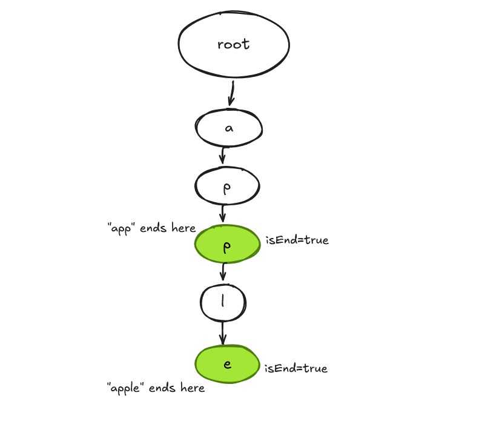
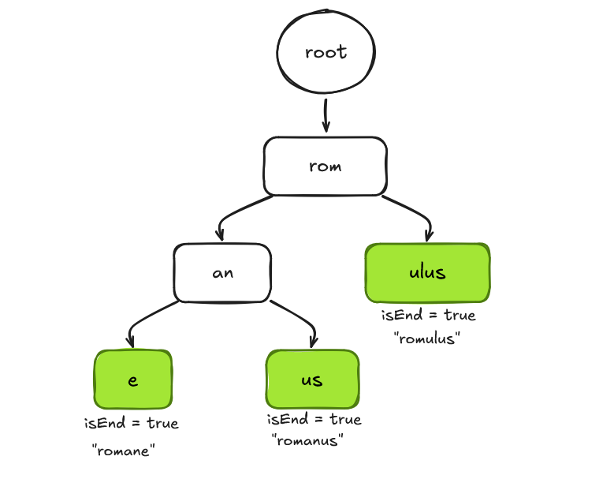

# CSF303 Practical 6

## Overview

This practical assignment focuses on implementing three fundamental algorithms that are critical for string processing and data structure manipulation:

1. **Trie (Prefix Tree) Algorithm** - For efficient word storage and retrieval
2. **PATRICIA Trie (Radix Tree) Algorithm** - Space-optimized variant of Trie
3. **Manacher's Algorithm** - For finding longest palindromic substrings in linear time

---

## 1. Trie (Prefix Tree) Implementation

### Algorithm Description

A **Trie** is a tree-based data structure that stores strings in a way that allows efficient retrieval. Each node represents a character, and paths from root to leaf nodes form complete words. The structure is particularly useful for autocomplete, spell-checking, and IP routing.

#### Key Components:
- **TrieNode**: Contains a dictionary of children and a boolean flag marking word endings
- **Insert Operation**: Traverses/creates nodes for each character, marks the final node as a word
- **Search Operation**: Traverses nodes matching characters; returns true only if the final node marks a word
- **Delete Operation**: Recursively removes nodes, preserving the structure for other words

### Implementation Details

**Time Complexity:**
- Insert: O(m) where m is the word length
- Search: O(m)
- Delete: O(m)

**Space Complexity:** O(ALPHABET_SIZE × N × M) where N is number of words and M is average length


### Reflection on Trie Implementation
#### Implementation Details & Mechanics

Implementing the basic Trie (Prefix Tree) helped me understand how tree-based string data structures work. The Trie is built using a TrieNode class, where each node stores child characters in a dictionary and a boolean variable called is_end_of_word to indicate whether a complete word ends at that node.

I found the insertion and searching processes relatively easy to implement. To insert a word, I would loop through each character found within the word to determine whether or not there was already an existing node for that character and create a new node if one was not found. If a path for that character already existed, I’d simply move onto the corresponding child node until I reached the last character. The searching process for a word was conducted similarly, but I looped through each character found within the word to determine whether or not the character/path exists until I reach either a match or confirm that a match was not found.

The deletion process requires recursion, starting at the last character of the word to delete the end-of-word marker. When a node is checked to be removed, nodes can safely be removed during the return back up the tree, unless they are used as part of another word or have children of their own.

#### What I Learned

By doing this practical I learned the classic Space-Time Complexity trade-off when implementing this algorithm. The time-Complexity for Searching and Inserting are extremely fast with strictly O(M) time Complexity where M is the size of the String and no relation to the size of the Tree in terms of the number of words stored in the Tree. The most surprising to me was the lack of space efficiency (a very obvious one). For every character in a word that does not share a prefix with other words, there is a separate node object created in memory for it.  I inserted a 20-character word and created 20 implementation instances (separate nodes) for it.  

Additionally, in going through the process of managing edge cases in the deletion process, I learned a lot. When using naive delete methods, the naive delete would only delete the end node of the deleted word while leaving the "garbage" nodes in the Tree. If I used the method to completely delete a whole path from the Tree, I may have inadvertently removed a shorter word which shares a path in that longer then (for example: deleting "app" may cause a break in the path to "apple"). The bottom-up recursive clean-up was a very rewarding logic puzzle that greatly helped me to understand How to Traverse the Graph and how to manage the Memory that is associated with Traversing the Graph.


### Trie Implementation - Execution Results:


### Trie Data Structure Diagram (After Insertions):


---

## 2. PATRICIA Trie (Radix Tree) Implementation

### Algorithm Description

**PATRICIA** (Practical Algorithm to Retrieve Information Coded in Alphanumeric) is a space-optimized variant of the standard Trie. Instead of storing single characters per node, it stores entire edge labels (prefixes). This compression reduces memory usage significantly, especially for sparse datasets.

#### Key Differences from Standard Trie:
- **Edge Labels**: Store multiple characters as labels instead of one character per node
- **Node Splitting**: When inserting overlapping prefixes, nodes are split at divergence points
- **Reduced Depth**: Fewer nodes required, leading to better cache locality

### Implementation Details

**Time Complexity:**
- Insert: O(m) where m is the word length
- Search: O(m)
- Delete: O(m)

**Space Complexity:** O(N) where N is total number of characters (significant improvement over standard Trie)

### Reflection on PATRICIA Trie Implementation
#### Implementation Details & Mechanics

Moving from a basic Trie implementation to a PATRICIA algorithm was much more complex and helped me understand advanced data structure and how they work. One of the major differences between the two implementations is that the RadixNode stores substrings rather than just individual characters per node. What I found most difficult to code and implement was the insertion logic. When inserting a word into the tree, the algorithm needs to check each outgoing edge from the current node to determine the Longest Common Prefix (LCP) with the incoming word. 

If there is a complete match between an incoming word and one of the outgoing edges for a node, we just follow the edge to its corresponding child node. But if there is only a partial match between an incoming word and the outgoing edge (e.g., if a node has the word 'romane' and I add 'romanus'), then the algorithm creates/uses an intermediate node for the LCP of the incoming and outgoing word (in this case, 'roman'), and then two child nodes ('e' and 'us') that branch from the intermediate node.

#### What I Learned

Implementing the PATRICIA Trie helped me understand why basic Tries are not commonly used in real-world systems like databases or network routers. A PATRICIA Trie improves efficiency by combining nodes that only have one child, which reduces memory usage and makes searching faster by lowering the number of pointer lookups.

Although this makes the structure more efficient, it also makes the implementation more complicated. I learned that handling strings and tracking indexes must be done very carefully, as small mistakes can easily cause bugs. When splitting a node, I had to update the parent node so it points to a new intermediate node, then connect both the old remaining substring and the new substring as child nodes.

This process also made me think carefully about managing the node’s state. For example, I had to decide what happens to the is_end flag after splitting a node and which node should keep the existing child nodes. I also learned that deletion in a Radix Tree is similar to reversing the split process. If deleting a word leaves a parent with only one child, those nodes should be merged back together to keep the tree compressed. Overall, implementing the PATRICIA Trie gave me a better understanding of how low-level systems and databases optimize text searching and storage.

### PATRICIA Trie Implementation - Execution Results:


### PATRICIA Trie Data Structure Diagram (After Insertions):


---

## 3. Manacher's Algorithm Implementation

### Algorithm Description

**Manacher's Algorithm** finds the longest palindromic substring in a string in linear time O(n), which is optimal. Traditional approaches using expand-around-center take O(n²). The algorithm cleverly exploits the symmetry property of palindromes to avoid redundant comparisons.

#### Key Concepts:
- **Preprocessing**: Insert separators (#) between characters to handle even/odd length palindromes uniformly
- **P Array**: Stores the radius of palindrome centered at each position
- **Mirror Point**: Uses previously computed information to initialize P values
- **Center & Right Boundary**: Tracks the palindrome with rightmost boundary

### Implementation Details

**Time Complexity:** O(n) - Linear time, optimal for this problem

**Space Complexity:** O(n) - For the preprocessed string and P array

**Algorithm Steps:**
```
1. Preprocess: "babad" → "^#b#a#b#a#d#$"
2. Initialize: C (center), R (right boundary), P[i] (radius at i)
3. For each position i:
   - Calculate mirror index i_mirror = 2*C - i
   - If i < R: Initialize P[i] = min(R-i, P[i_mirror])
   - Expand around i while characters match
   - Update C and R if palindrome extends beyond current boundary
4. Extract longest palindrome using max P value
```

### Reflection on Manacher's Algorithm Implementation
#### Implementation Details & Mechanics

Manacher’s algorithm is used to find the longest palindromic substring in linear time, or O(N), which makes it much faster than many traditional approaches. Implementing this algorithm helped me understand how dynamic programming and string manipulation can be combined to improve efficiency.

The first step of the algorithm is preprocessing the string. Special characters, such as #, are inserted between every letter, and unique symbols like ^ and $ are added at the beginning and end of the string. This converts all palindromes into a uniform odd-length format, which removes the need to handle even-length and odd-length palindromes separately.

The main logic uses an array called P to store the radius of the palindrome at each position in the processed string. Two variables, C and R, are also maintained, where C represents the center of the palindrome currently extending the farthest, and R represents its right boundary.

To improve efficiency, the algorithm uses the mirror position of the current index relative to the center (2 * C - i). By checking this mirror value, the algorithm can reuse previously calculated palindrome lengths instead of repeatedly comparing characters from scratch. This avoids unnecessary work and allows the algorithm to run in linear time.

#### What I Learned

Implementing Manacher’s algorithm was one of the most interesting learning experiences for me. Before learning this algorithm, I usually thought of solving palindrome problems using either the brute-force approach with O(N³) complexity or the expand-around-center method with O(N²) complexity. Manacher’s algorithm showed me a much smarter way to solve the same problem in linear time.

One important lesson I learned was the idea of state retention. By keeping track of the farthest right position already checked (R) and the center of that palindrome (C), the algorithm avoids rechecking the same characters again and again. This makes the solution much more efficient.

The most difficult part for me to understand was the formula P[i] = min(R - i, P[i_mirror]). At first, it was confusing, but later I understood that if the current position is inside a palindrome that has already been found, then its palindrome length can often be copied from its mirror position on the opposite side of the center. The only exception is when this copied value goes beyond the known right boundary R.

This helped me understand the importance of symmetry and reusing previously calculated results. Overall, the algorithm taught me that highly optimized solutions are not just about making code faster, but also about finding smarter ways to avoid repeating the same work.

### Manacher's Algorithm Implementation Screenshot:


---

## Conclusion

These three algorithms represent fundamental concepts are:

1. **Trie** introduced me to tree-based data structures and showed how memory usage and search speed can be balanced depending on the design.
2. **PATRICIA Trie** taught me how data structures can be optimized by reducing unnecessary nodes and compressing data to save memory.
3. **Manacher’s Algorithm** showed me how mathematical ideas and smart logic can be used to solve problems much faster than basic approaches

These three algorithims serve as a basis for many advanced string processing and data retrieval problems. Knowing each of their positive and negative aspects, or strengths & weaknesses, as well as what types of problems these algorithims are best suited to solve, is important for building effective software systems.

---

